# 🤦‍♂️ What the fuck just happened with FTX? 🤦‍♂️
## The FTX saga told by a crypto-native who watched it all unfold on-chain in real time
##### (Including all the juicy details not reported by Reuters and NYT)
by 📯 ~ Robriks / 👦🏻👦🏻.eth ~ 📯

```
     W
     T
     F
   B   T
 S       X
```

I've had a number of people approach me about the events that have transpired over the past week with regard to FTX and the rapid downfall of SBF. There's a lot of media coverage on the story but as someone who watched the entire debacle unfold on-chain in real time, there are numerous absolutely insane events in the story that haven't been adequately told.

If you want a complete picture of the 4 day clusterfuck during which a centralized exchange collapsed to a bank run exposing insolvency, wealthy customers bought illicit Bahamian passports to exploit a 'legal loophole,' and a blackhat hacker vs whitehat official faced off on-chain to claim control over hundreds of millions of dollars worth of digital assets left over from FTX reserves, read on. Yeah, bet you didn't get those juicy details from the Reuters and NYT articles, huh?

I'll do my best tell the tale of my (sleepless) experience of FTX's fall from grace with as thorough explanation of technical and financial details as I can, so an audience who has never so much as touched a cryptocurrency can easily follow.

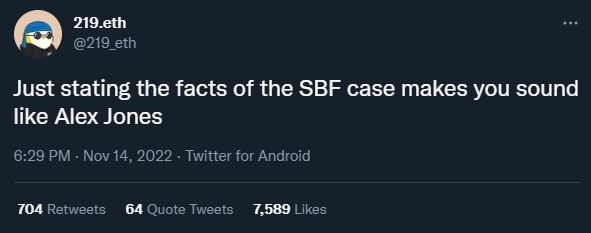

Being a 'crypto-native' and having studied Solidity code as a blockchain dev, I've seen a lot of crazy things in the industry over the years. Of numerous spectacles that come to mind, good and bad, this catastrophe easily contends for the top three. This was a big deal. Yikes.

If you were personally affected by the fallout, my sympathies are with you. 😔😔😔

Losses due to FTX could easily have happened to anyone; we were all conned by SBF. Very few people, even those with deep expertise in the space, believed anything like this was possible. Let's make sure it never happens again- more on that later.

## About FTX and [the dangers of] centralized exchanges

Let's start with the basics: what is FTX? 

FTX was an exchange for users to buy, sell, withdraw, and send various cryptocurrencies. Users could deposit fiat (dollars, euros etc) to purchase digital assets and trade them to speculate on their price or send them to external wallets for self-custodial management. This works much like FinTech products that may be more familiar such as Robinhood, Venmo, or CashApp which also offer access to blockchain networks like Bitcoin and Ethereum.

FTX enjoyed a meteoric 📈 rise 📈 to the top of crypto's centralized exchange industry, growing so rapidly over a short 3 year period that it soon rivaled industry incumbents like Coinbase, Gemini, and Kraken. At its peak, FTX was estimated to bear a $22 billion valuation. Along the way, this rapid upward trajectory was marked by congressional hearings, SuperBowl commericals, Tom Brady, and meetings with the head of the SEC: Gary Gensler. These figures will be discussed in a later section but first a few housekeeping elements to briefly go over.

Due to the opaque state and lack of regulatory clarity, most centralized cryptocurrency exchanges based outside of the US split their product offerings into two categories: a more conservative US division and a separate global division. Residents of the USA can only access the US division of exchanges like Binance and FTX (binance.us and ftx.us respectively), whereas users outside the US are given access to the global division (binance.com and ftx.com respectively). Since FTX was based in the Bahamas, it adhered to this trend with two offerings: FTX US / FTX International. These were supposed to be kept separate... Ha.

## The difference between a blockchain protocol and a custodial crypto trading platform

Before I continue to the people involved in the scandal, I want to emphasize the importance understanding that FTX is _not_ synonymous with crypto. FTX was a centralized, corporate entity that custodied crypto for its users largely off-chain. Think of this as the difference between a petroleum company like Enron or a bank that custodies cash for its users. To decry all blockchain technology or crypto networks as a ponzi scheme after the FTX collapse is comparable to decrying petroleum as a ponzi scheme after Enron's collapse, or decrying cash as a scam because of the Lehman Brothers bankruptcy. These are companies providing services that are tangential but still connected to external crypto protocols. 

Now more than ever, I strongly encourage crypto users to self-custody their digital assets. Software wallets are acceptable but nothing beats a hardware cold wallet. Allowing FTX or any other exchange to custody your private keys will always bear inherent centralized custodian risks, as we've seen in the past week.

_Not your keys, not your coins_

## The origin story

At the center of FTX's success lay its founder and CEO: Sam Bankman-Fried, aka SBF.

SBF was hailed by mainstream media outlets as a wildly successful startup founder. He made the Forbes 400 frontpage as billionaire wunderkind of the newfangled crypto industry,

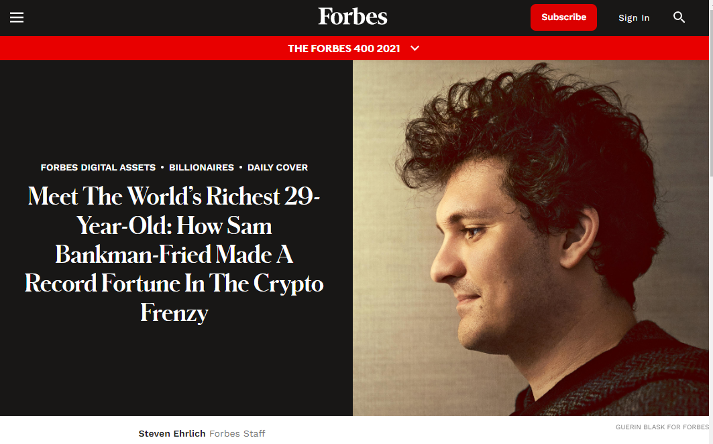

bought name rights to the Miami Heat sports stadium (FTX Arena), 

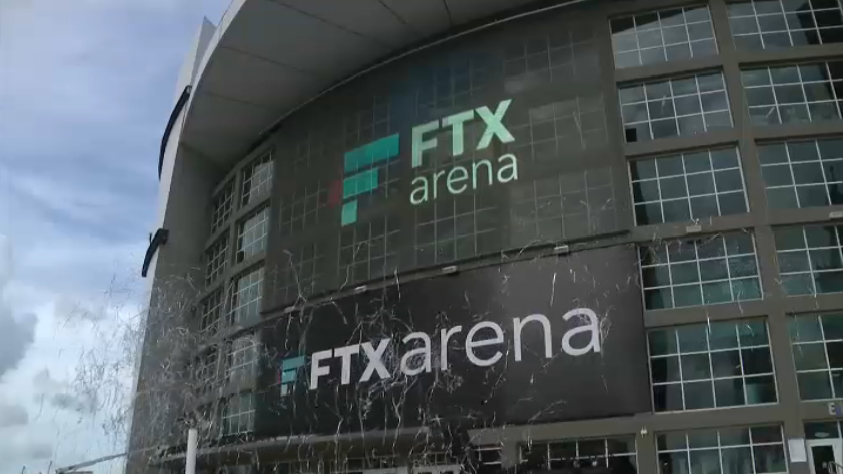

bought a superbowl commercial featuring Larry David, 

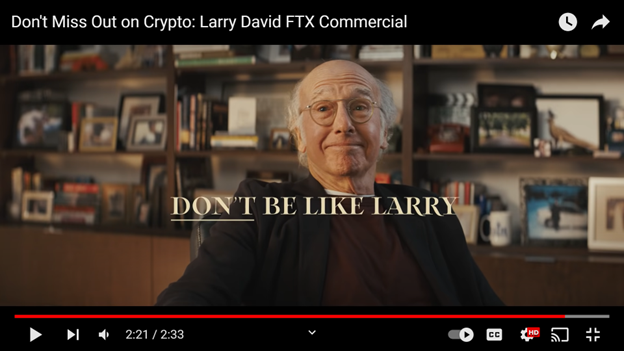

and had Tom Brady as one of their biggest marking partners 

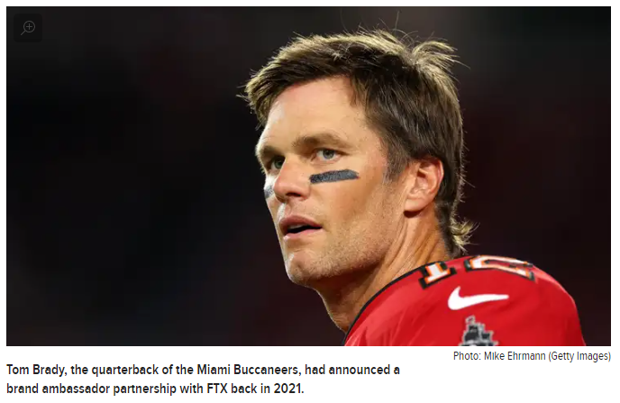

##### (Tom and his wife Gazelle invested 70mil of their personal funds into FTX)

SBF enjoyed such rapid and well known success that he did numerous interviews pushing a popular philosophical doctrine called effective altruism which basically boils down to amassing power and wealth to donate it for good causes. He tirelessly cultivated the image of the 'crypto golden child' who planned to donate his fortune, drove a Toyota Corolla, and even adhered strictly to veganism. It worked; he enjoyed favorable attention from lawmakers, CEOs, investors, and retail demographics alike.

Much of the funds he got to start FTX were made as a global arbitrageur and trader while serving as CEO of a very successful hedge fund called Alameda. When FTX grew large enough, the conflict of interest between owning and operating FTX while simultaneously heading a hedge fund like Alameda that actively trades on FTX exchange became clear. A large market maker like Alameda should not be run by the same CEO that owns the exchange it trades on, because the hedge fund could be using insider info or trading predatorily against users.

## The love interest, Caroline Ellison

To 'remedy' this conflict of interest, SBF relinquished control of Alameda to his romantic partner, Caroline Ellison, and committed full-time to FTX. It's worth noting it was generally well known that SBF was still tangentially involved with Alameda (the details of which are still surfacing: it's now publicly known that he actively discussed large Alameda trades) but the since FTX is headquartered in the Bahamas and is much less regulated than if it were based in the US, these red flags were largely ignored.


In addition to living with and being romantically involved with SBF, the CEO of Alameda, Caroline Ellison, has ties to some important people. Her father, Glenn Ellison, is head of economics at MIT which is the department that the current SEC head, Gary Gensler, used to work.

##### Pictured: Glenn Ellison, MIT Economics Dpt Head


##### Pictured: Gary Gensler, SEC Chair / formerly MIT Economics Dpt

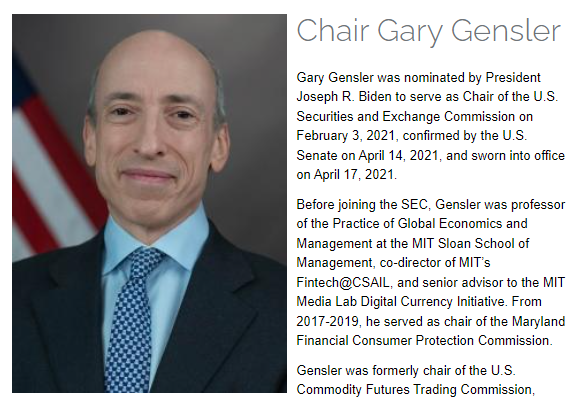

Their collegial tie, now extending to the SEC, is suspected to have contributed to SBF's favorable treatment in Washington by regulators and legislators. SEC head Gary Gensler met with SBF personally on March 23rd this year to negotiate a letter of No-Action Relief, which is an agreement not to prosecute for minor violations of securities law given by the SEC in special circumstances, in this case most likely because crypto is a brand new asset class and the industry does not fit cleanly into existing laws.

##### Pictured: Record of SBF personally meeting SEC Chair Gensler for a letter of No-Action Relief
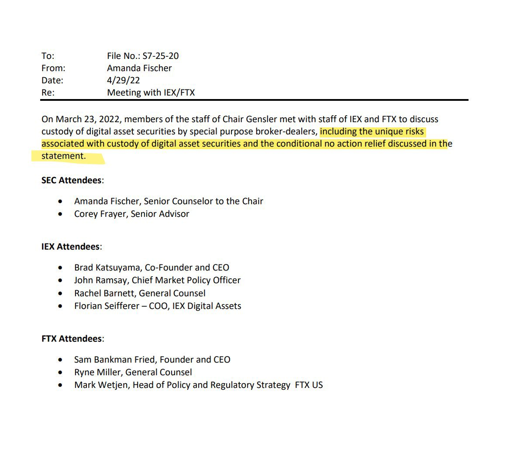
##### More on No-Action Relief: https://www.investor.gov/introduction-investing/investing-basics/glossary/no-action-letters

I will add here, though it looks very bad for the SEC and for Gary Gensler, I _personally_ do not believe this was an act of corruption. The SEC is notoriously incompetent when it comes to crypto as they have (imho) made some very badly informed public statements. Chances are Gary and the SEC honestly believed SBF to be legitimate, as did the rest of us. This may have looked like the most logical way forward from their perspective at the time. The SEC just didn't do due diligence, investigate for criminality, or otherwise audit/evaluate FTX the way they should have.

Anyway, I'll limit speculation in this writeup. Back to facts. SBF's reputation in Washington was so robust that he was tapped as _THE main consultant_ for drafting the current foremost regulatory bill on crypto in the US: the DCCPA. 

Here's a digital document of the bill: https://www.congress.gov/bill/117th-congress/senate-bill/4760/text

SBF was in talks with legislators on Capitol Hill, very close to the provisions of the bill. He personally pushed the bill in the industry and lobbied congresspeople on it, giving public testimony before congress just months ago. Part of his sway here can likely be attributed to the fact that SBF/FTX was the 2nd largest donor to the Biden campaign and other politicians on both sides of the aisle.

It's not confirmed whether FTX/Alameda were actively committing fraud by siphoning user balances to trade with at this point but seeing as SBF's activity in DC is very recent and reports of FTX's losses are to the tune of $10+ billion, it is likely.

So, that is the magnitude of SBF's and FTX's reputation. Let's now move from background and onto a few technicals before I detail the finances.

## Quick note about on-chain tokens

The last bit of prefaced information you need to understand before I detail FTX's criminality and implosion are the concept of on-chain tokens. This piece will only focus on fungible ones, since non-fungible ones are not relevant to this story in particular.

If you're not familiar with how (fungible/non-fungible) tokens can live on top of blockchain networks like Ethereum, I have a writeup that explains this in my free interactive Web3 tutorial: [HuskyCoin](https://huskycoin.vercel.app/about)

##### (The HuskyCoin tokens I made are for education only. They are free and cannot be speculated on!)

But that's a minor component to the saga so you may come back and learn that another time if you prefer to keep reading. The basics of what you need to understand is this: Ethereum is a programmable blockchain that allows for tokens to be created, sent, received, staked, burned, bought, and sold (among other cool things) on the Ethereum network itself. Examples include stablecoins (pegged to the US dollar) such as $USDC, $USDT, $DAI as well as utility tokens such as $UNI, $LINK.

## The FTT token

Central to FTX's implosion is their token: FTT.

FTT is a fungible ERC20 token issued by FTX and housed on Ethereum. It does very little in terms of on-chain utility, only offering some discounts on trading fees to tokenholders, and is highly centralized.  

The general rule of thumb for tokens is as follows: only tokens that are actually useful on-chain _AND_ meaningfully decentralized carry value in the long term. Why? It boils down to the old economic adage of supply and demand: for a token to bear and generate demand, it must be _useful_ whether for staking security, information bridging oracles, DeFi utility like leverage, fee distribution, or even governance via 1 token == 1 vote. A token without utility can only be transferred back and forth or speculated on... looking at you, $DOGE, $SHIB, $MOON. 

In hindsight, FTT should have served as a major red flag because unlike $ETH, $BTC, $BNB, $UNI, $LINK, etc it doesn't fit those criteria.

To make matters worse, FTX controls more than 73.4% of FTT supply, which is easily verified on Ethereum even now. I've included a screenshot doing so via Etherscan below.

##### Pictured: The top two holders of FTT (summing to 73.4% of supply) are addresses belonging to FTX
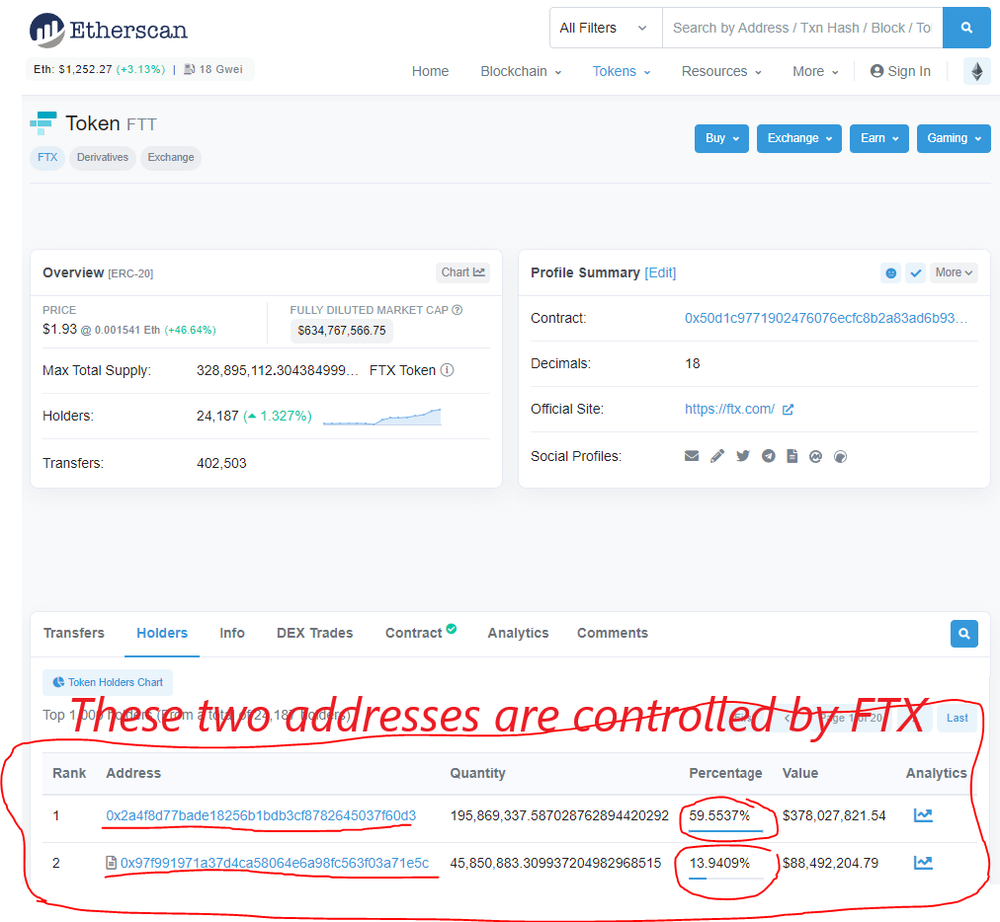

Isn't on-chain transparency and verifiability a marvel!? You can even see every transfer in each block as it happens in real time, powered by cryptography. Full public transparency is an inherent property of blockchains, which uniquely underlines the strength of Decentralized Finance. As you'll soon see, this was the most important factor in piecing together the events of FTX's collapse as they unfolded in real time.

Moving on, the market cap of FTT grew quite large in recent years as speculators drove the token value up because they wanted a piece of FTX's wild success. All despite the risks of purchasing and holding a token serving little to no on-chain utility in market conditions where one corporate entity controls 73.4% of supply. 

##### (Hey regulators, please give the industry sensible regulatory clarity that is well informed on the technical workings of blockchains. plz)

## Onto the financials, where issues began surfacing.

FTX made many investments in the industry, famously bailing out entities like BlockFi and Voyager, as well as accumulating numerous hefty loans. On Nov 2. 2022, CoinDesk (one of the largest, most reputable crypto-specific media outlets) got wind of the Alameda Research balance sheet largely comprising of $FTT tokens and subsequently released a report.

Seeing as Alameda and FTX were legally supposed to maintain distinct separation, this made a number of people uneasy. How separate are FTX and its star trading fund serving as its main market maker, really?

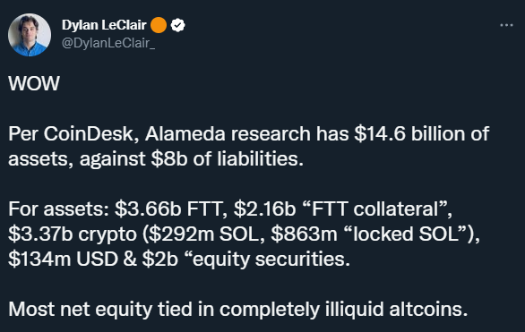

While the value of FTT had been driven up by speculation, it was done on the currently circulating supply, which only reflects a limited portion of actual total supply. And at pretty low volume, too.

That meant there was much, much less liquidity depth than the market cap of FTT on paper.

In theory that's not such a huge problem, provided 
1. FTX and Alameda are indeed totally separate
2. FTX fully sandboxed user deposits away from their own balance sheet, which is what every exchange is supposed to do to remain solvent. (It's in the exchange's terms of service that user funds are NEVER to be reappropriated)
3. Alameda does not ever trade using assets from either FTX's balance sheet or FTX's user deposits
4. FTX's outstanding loans are not overwhelmingly collateralized by illiquid FTT holdings

Whew, unfortunately these were not the case. But we are not there just yet, let me detail events in chronological order

## Binance's role in catalyzing a bank run

Binance got wind of the Alameda Research position, as well as FTX's numerous outstanding loans collateralized by... well, you can probably guess: 🚩 FTT 🚩

Hefty debts riding on a low-utility, low-liquidity token that are issued by the borrower themselves? 😔

In light of this information made public by CoinDesk, the Binance CEO, CZ, publicly tweeted they would be selling their FTT allocation (Binance was an early backer of FTX) to the tune of $600 million. It doesn't take much sleuthing to realize the FTT market could not handle the unloading of such a large position without significant downside volatility. 📉📉📉


Okay, so Binance will dump a metric shitton of $FTT and the token price will tank. What's the big deal? The market should be able to flush out leveraged positions just fine, right? In theory, so long as FTX isn't breaking laws and hasn't accumulated large amounts of debt owed to industry-wide players in the form of loans collateralized by FTT, they should be fine...

Spoiler: they were not fine. They had essentially formed a massive industry-wide leveraged long position on FTT.

##### If you're not super familiar with how debt collateralized by a low liquidity asset can add up to a leveraged long position, imagine this scenario: would you rather lend money to your aunt who promises to give you her brand new 2022 Tesla if she defaults on the loan or would you rather lend money to your uncle who promises to give you his three 1995 Saturn S-Series beater sedans with 200k miles on them in case of default? The aunt is providing collateral that is more easily liquidatable, so that's the clear choice in this scenario.

## Then something strange happened. 

Who instantly responded to that tweet? None other than Alameda CEO Caroline Ellison, who publicly declared she would gladly buy ALL of the Binance allocation. On the spot. For 22$ each, which would amount to a sizeable overpayment.


But wait a second, why the hell is the CEO of Alameda offering to buy that entire position at a very specific price above the market rate in current liquidity conditions? Alameda should not be stepping in like this... Gurl, y u being sketch af ???

As Binance begins selling their $FTT position (believed to have been executed using a combination of OTC and public trades), many retail users follow suit and sell their $FTT further depressing its price. Much worse, Alameda's on chain behavior is now rapidly becoming very, very concerning.

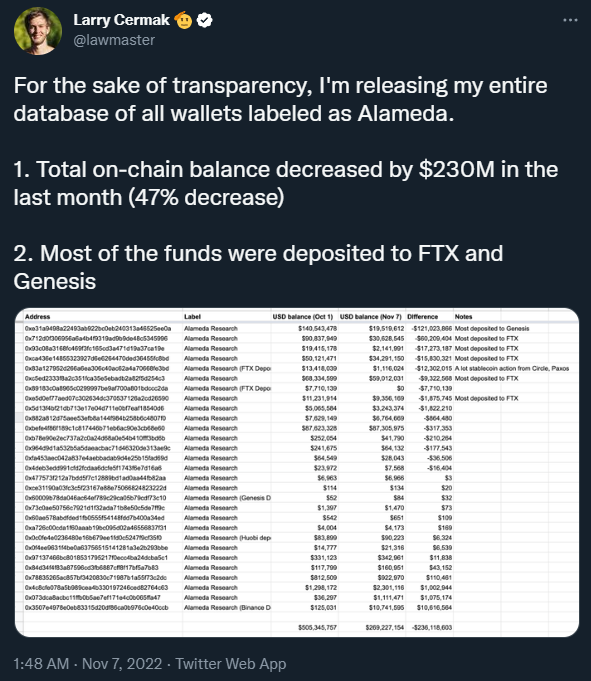

Within hours, addresses belonging to Alameda began pulling funds out of every on-chain market nook and cranny they had exposure to and sending it to FTX to purchase FTT in order to defend its 22$ price point and keep it from falling.

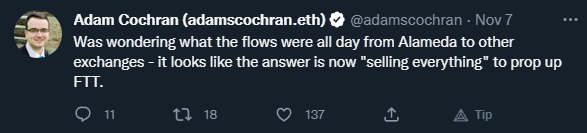

Why on earth is a hedge fund doing that? Well maybe they just had outsized leverage with a liquidation point at $22. But this is Alameda we're talking about, supposedly the best trading firm in crypto. Their erratic behavior was only accelerating and such a sophisticated fund should not have gotten to such a position on a largely illiquid position to get caught swimming naked like this.

Meanwhile, rumors of SBF desperately scrambling to find funding anywhere he could are circulating. Figures at first ranged from 1-2 billion, then 5-6 billion, eventually settling at $10 billion...

## Binance steps in: a tentative bailout

Binance sees the chaos they've instigated, now ballooning to a full blown bank run with users and businesses alike pulling funds out of FTX. According to a tweet FTX, they've stepped in and offered to potentially purchase FTX; essentially bailing them out. Note the very certain, grateful tone:


Binance likely did not know the extent of FTX's losses (and definitely not their fraud, we're getting there!), because after they got one look at FTX books they immediately backed out and did not commit to the acquisition.

Now the cat is out of the bag. How the FUCK did FTX lose 10 billion? 

FTX users are now panicking, approaching fever pitch in withdrawing their funds to off-chain addresses and TradFi bank accounts. On-chain data shows sluggish withdrawals that continue to grow more and more infrequent.

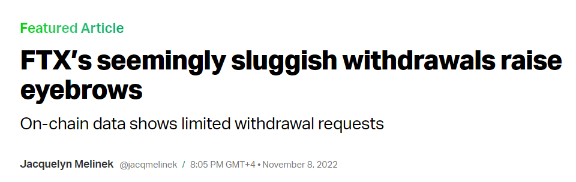

## Well, without Binance's bailout, at least FTX is solvent since they can't touch user deposits... right?

According to FTX terms of service, user deposits are required to be kept separate from the FTX balance sheet so they should all be safely custodied and ready for withdrawal, even in the case of a bank run. Thank goodness!

Wait, what?! Alameda is now collecting funds from every known on-chain position and rapidly sending them to the FTX reserve address?! There can only be one explanation for this: Alameda is funding user withdrawals in real time, visible on-chain. 

WHAT THE FUCK? Alameda should have _zero_ access to user funds. Zero!

An 'external' hedge fund providing funds for users to make withdrawals implies the two entities are not separated and Alameda had likely been trading on the market with funds that belong to users! I Am Not A Lawyer, but we're currently watching unforgeable and immutable evidence of _criminal_ behavior happening between Alameda and FTX on Ethereum.

The bank run soon drives FTX.com to insolvency, confirmed when users outside the US find themselves unable to withdraw.

## SBF: Don't worry, it's just FTX.com; FTX.us is fine

Once withdrawals are frozen on FTX International, SBF assures US residents that FTX US is solvent and has no cause for concern:

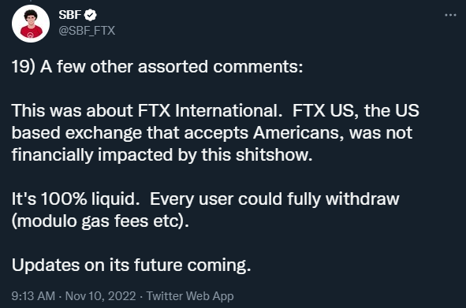

FTX US files for bankruptcy the next day. Withdrawals to US residents are halted, despite clear claims to the contrary by SBF.

Well, at least it's all over with now that FTX has filed for bankruptcy (Nov 11). It can't get any worse than this...

## The Bahamian Loophole

Some quiet rumbling has begun onchain at an address belonging to FTX. Funds are at this very moment moving out of the FTX address, despite users having been told withdrawals are frozen. How can that be?

A small cohort of addresses are withdrawing funds on-chain after withdrawals were officially halted? In response to tweets pointing these on-chain anomalies out, FTX tweeted the following:

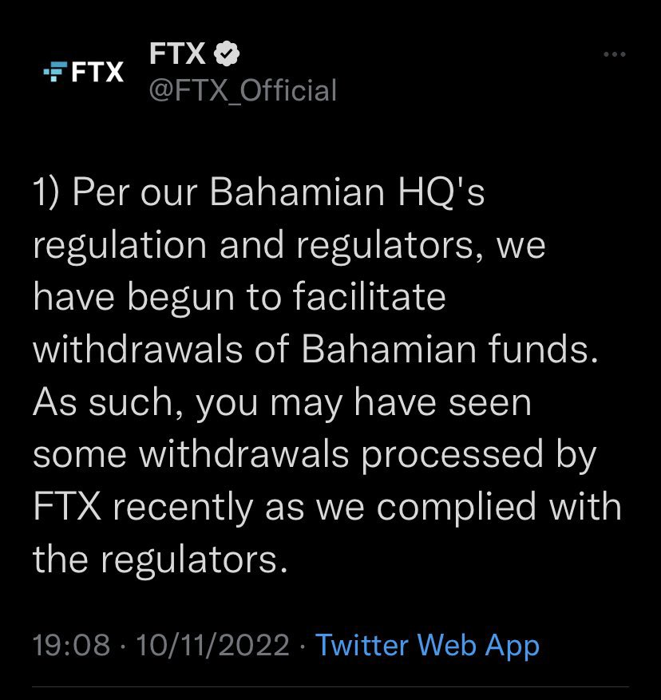

Supposedly Bahamian regulators have cited some strange esoteric Bahamian law that requires companies like FTX to let Bahama residents get their funds. Sketchy, but we're only 48 hours into this mess so.. ok whatever? ¯\_(ツ)_/¯

Snapping into action, wealthy FTX users begin scrambling to get ahold of Bahamian passports. Some were reportedly purchased for $160k just so that they could falsify KYC, pose as a Bahaman to evade the freeze on withdrawals, and reclaim their funds. Presumably FTX employees were bribed as well, though I only saw rumors of that fact. 

A few individuals indeed were able to pull off this mini-heist and managed to withdraw, the most famous being AlgodTrading, whose crimes can be easily summarized by three of his tweets during the meltdown:

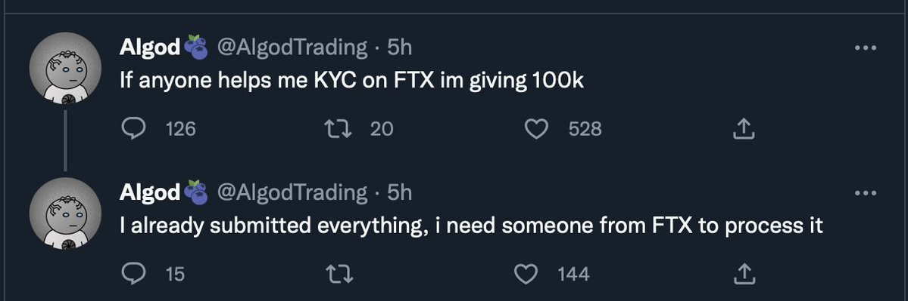


##### If you're not familiar with the term 'KYC' it stands for 'Know Your Customer' which are an extension of anti-money laundering laws that require exchanges to verify their identities, citizenship, and place of residence.

The follwing day, Nov 12, Bahamian financial authorities at the Securities Commission of The Bahamas tweeted a document contradicting FTX's claim of being directed to allow withdrawals to Bahamians. Turns out, there is no such Bahaman law and that was a falsehood, presumably to allow people close to FTX (remember that FTX is based in the Bahamas) to withdraw their funds.

##### Pictured: The document in question
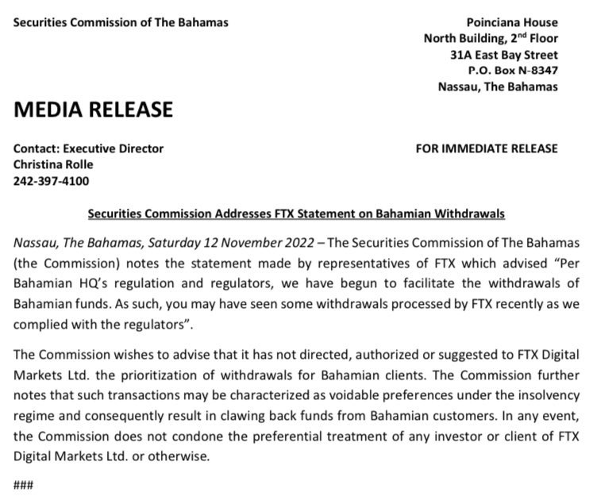

With FTXcom and FTXus having together filed for bankruptcy, it is slowly becoming clear that SBF used user deposits to fund Alameda's trading losses. It is even uncovered by Reuters that he instituted a backdoor to the FTX books to falsify their records:

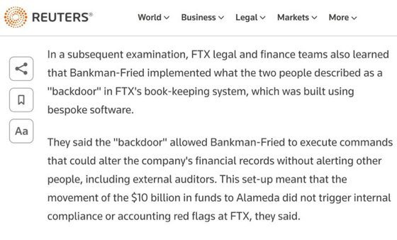

## At least it's finally over??

At this point, I've been watching on-chain activity on Etherscan for a couple days. Who could get sleep at a time like this, where every few hours a devastating new twist would rear its ugly head. At each announcement, I kept thinking to myself: 'This is so awful, surely it can't get any worse.' And then it got worse, every damn time.

But now it's over for sure since bankruptcy is filed and the Bahamian loophole closed. Nothing else can possibly happen... right?

## The Blackhat vs Whitehat faceoff

Movement stirs yet again on-chain at the FTX address.

In the wee hours of early Saturday morning (Nov 12, 02:22am) the FTX reserve address sent an odd looking transaction to a brand new address. It's a large sum of money, and subsequent transfers are growing the amount by the minute.

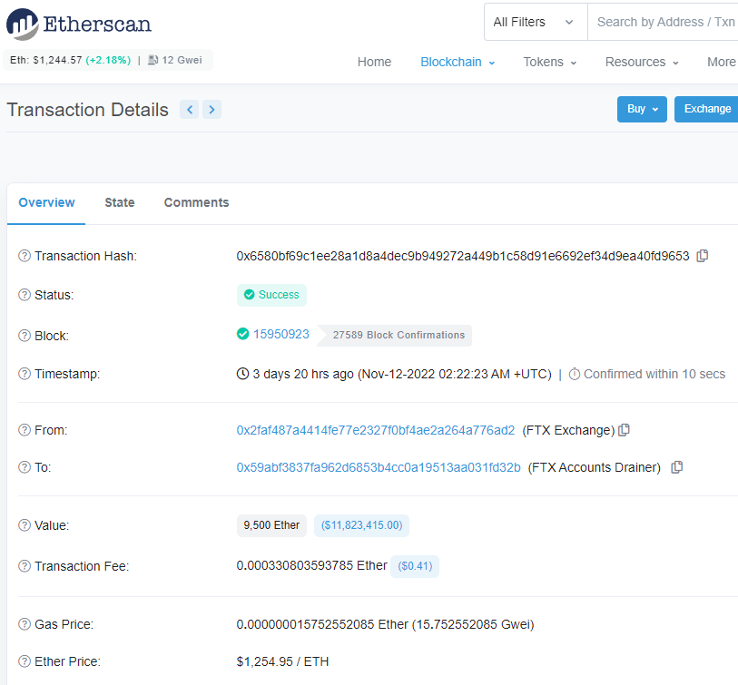

As you can see in the initial transfer above, the amount is for 9500 $ETH or roughly $12 million. This came from the FTX International address, but follow-up transfers including from the FTX US address are rapidly being made, soon bringing the total value sent to the tune of hundreds of millions of dollars.

Who initiated that transfer? A legally appointed counsel or liquidator moving funds to the custody of authorities? Why would an appointed authority be moving funds in the middle of the night like this, much less on a Saturday? Surely it's too soon for that sort of thing...

Dumbfounded, staring at my screen with my jaw agape and my blood running cold, my worst fears are confirmed: funds are being swapped from censorable assets (USDC, USDT, PAXG) to uncensorable ones (DAI, WETH). These swaps are being made at egregious rates of slippage (at times losing up to 25%).

##### Pictured: The drainer's first tx https://etherscan.io/address/0x59abf3837fa962d6853b4cc0a19513aa031fd32b
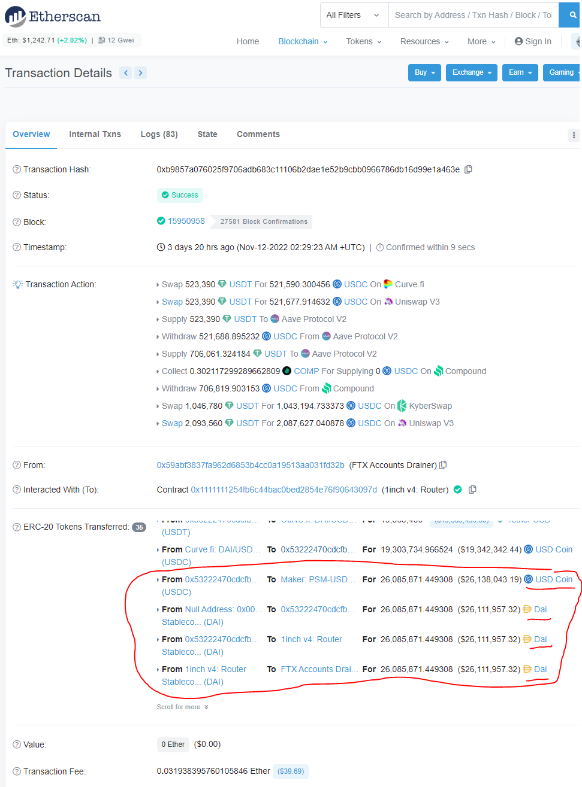

WHAT THE ACTUAL FUCK??? THIS IS BLACKHAT HACKER BEHAVIOR!

Rumors begin to fly that FTX has been hacked. But some things don't add up: why would a hacker make such shoddy transactions unless they either don't understand crypto and markets very well or they are in quite a rush. 

We're long past this being a legally appointed liquidator at this point. I'm starting to feel certain this person is in a rush, so I check Twitter for updates from well-known blockchain sleuths. Since I'm not a Solana developer, I haven't been watching FTX activity on the Solana blockchain at all but developers more skilled than I have already pointed out questionable transactions there in addition to the Ethereum ones I've seen. Apparently, those funds are being bridged to Solana right now.

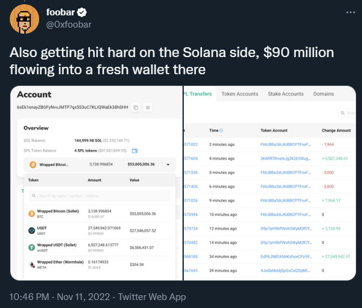

To make matters even worse, reports are being posted to Twitter that while the suspicious transactions are processing, the FTX website and app have been force pushed updates. Users en mass report that their FTX balances have been set to 0, which almost certainly has something to do with the funds being moved out of the FTX addresses!

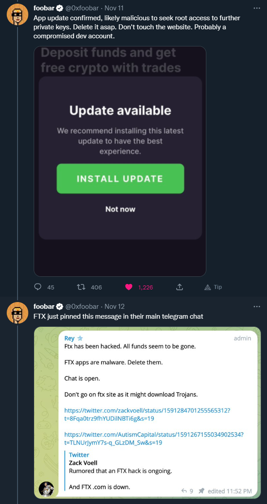

Hack confirmed.

Who on this earth possesses developer keys for an app update, root access to the FTX website, _AND_ control of the private keys to the FTX International + FTX US reserve addresses on both Ethereum and Solana? There is only one possibility for such extensive privileged access to FTX infrastructure: an insider.

To add to the drama, just 1 hour and 12 minutes later the reserve addresses begin scrambling to send remaining funds to ANOTHER ADDRESS, this time a multisig contract. This is highly unusual as a malicious actor would have no need for the multi-party custody that multisig contracts offer. Plus, if they were in such a rush earlier, why would they go through the hassle of deploying one and separating funds from the first address they used?

Are there... two hackers?? Both are currently racing to drain the reserve of its balance in a series of transactions, but to different destinations. One of these being a multisig implies that they don't trust each other.

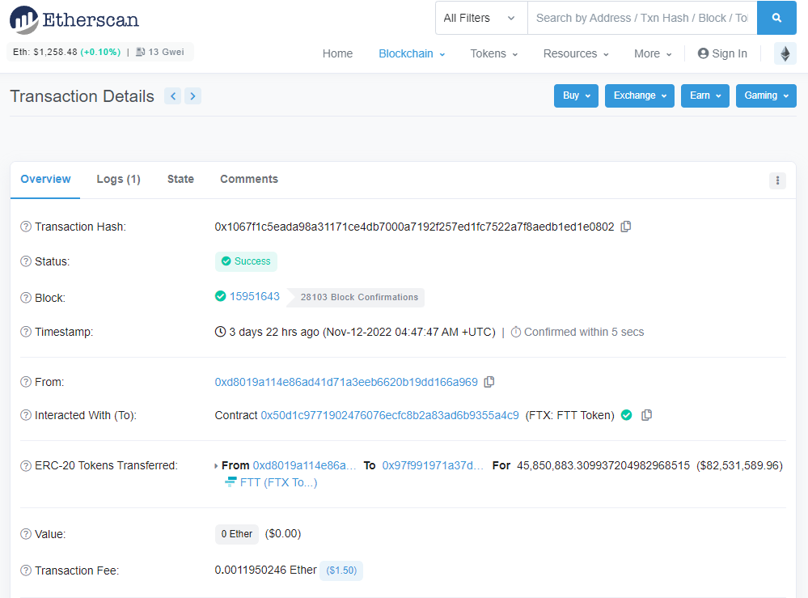

The situation has devolved into perhaps the most exciting on-chain heist in history. I'm watching lofty financial crimes that will someday be told in movies and studied in textbooks from my computer at home and struggling to put the pieces together.

What the fuck is happening? Thankfully general counsel legally appointed by the bankruptcy proceedings, Ryne Miller, tweets out a bit of clarification, confirming the abnormal transactions executed without his knowledge.

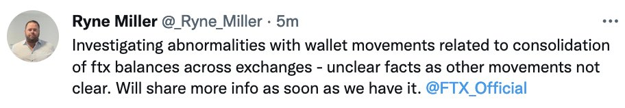

The damage to the FTX reserves currently stands at $568 million, split between $302 million to the first suspicious wallet and $266 million to the multisig.

A second tweet from the general counsel confirms what on-chain sleuths are already speculating on Twitter: the multisig is a whitehat attempt to salvage any funds the blackhat hasn't already stolen. What we're seeing right now is the blackhat and the whitehat racing to claim control over funds that haven't yet been removed from the reserve addresses. In real time. Absolutely surreal.

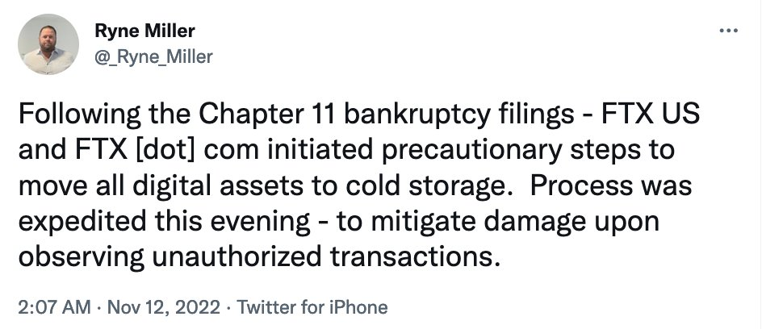

Yes, you heard me. An insider at FTX attempted to run off with what's left of FTX (clearly in a rush), successfully gaining control of the $568 million. The second address (that managed to take control of the $266 million) sprung to action and saved assets that hadn't yet been swept away by the attacker by sending them to a multisig for cold storage. Heroic, really!

## Side quest from yours truly

Just 6 minutes after the whitehat entered the fray against the blackhat hacker, I sent a transaction to the blackhat's original address with some spicy utf-8 encoded word strings for their actions. Fat lot of good it'll do, but I wanted them to know the heinous nature of their crime, whoever it may be.

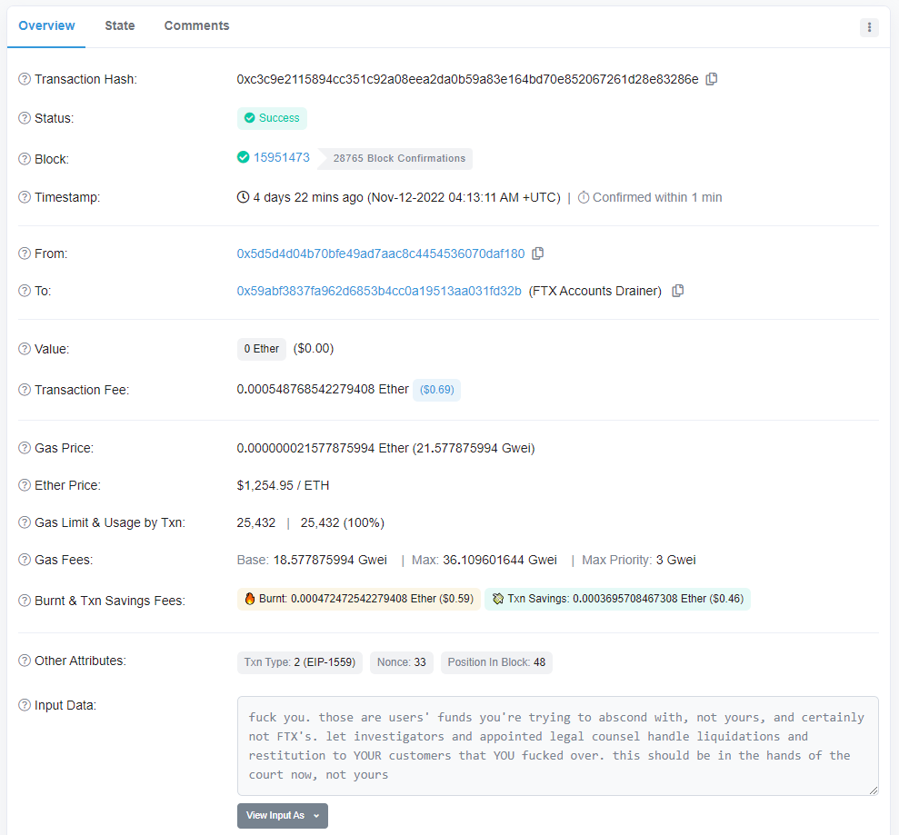

This makes no difference at all to the catastrophe, but in that moment I left my mark. Due to Ethereum's immutable nature, it's a permanent one. Fun fact: I was only the 38th unique external address to interact with the blackhat.

## Aftermath

Holy shit. Just holy shit. Did the NYT article tell you about all this that happened? No, didn't think so. I can't even begin to explain how shocking it was to see the events that transpired over 4 days. In such a short time span, we went from simple rumors of bad debt to the bank run that eventually uncovered the insolvency and then to the on-chain police chase of a whitehat competing against a blackhat hacker.

Suffice to say, I didn't really sleep much those few days.

I'm happy to report that SBF and his closest associates are reportedly detained in the Bahamas before completing a flee attempt to Dubai. The level of fraud here combined with the public exposure and the sheer dollar value of assets affected will hopefully result in jail time for these bad actors.

## How could this have been prevented?

This must not be allowed to happen again. The FTX meltdown was unacceptable and harmful for all involved on many levels. The crypto industry cannot afford to let grifters and fraudsters take first claim to innovative blockchain technologies and abuse them for personal gain at the cost of others.

We needed regulatory clarity before this all went down, and now it's a foregone conclusion that it's coming. It may be long overdue but it's a sorely needed step in the right direction. I only worry that regulators and politicians will overreact, bringing down the hammer fueled by rage at having been hoodwinked.

SBF is not crypto, nor does he represent blockchain technology. But he tried very hard to become the face of the industry and it largely worked.

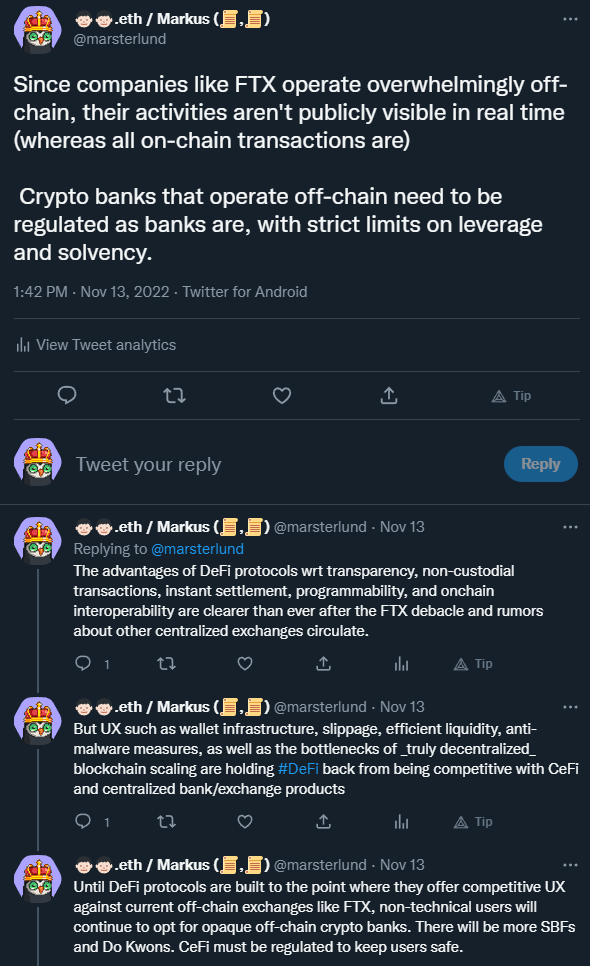

## What does this mean for Web3 moving forward?

Is a massive selloff in the markets coming? Will bankruptcy proceedings entail heavy liquidations that push the prices of digital assets down? Has Web3 winter only begun? Most importantly, will the innocent users and developers who were harmed by Sam Bankman-Fried's mishandling of FTX be restituted for their losses?

I don't know. I don't give financial advice. I can't speak for the many lawyers and regulators who will handle the situation going forward. We will see.

But I am sure of one thing: crypto is not dead. These open-source protocols are designed to be anti-fragile and self-sustaining. Web3 grew out of a similar but even worse collapse in 2014 when MtGox imploded. Once Pandora's box has been opened, open-source blockchain technology like Ethereum can't be put back inside.

It's here to stay. 

### Hope you enjoyed my tale.
##### -KweenBirb
